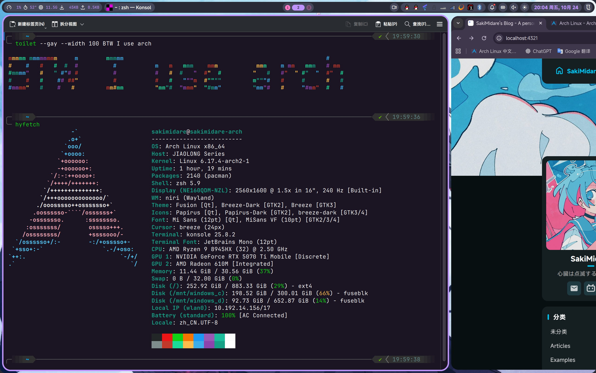
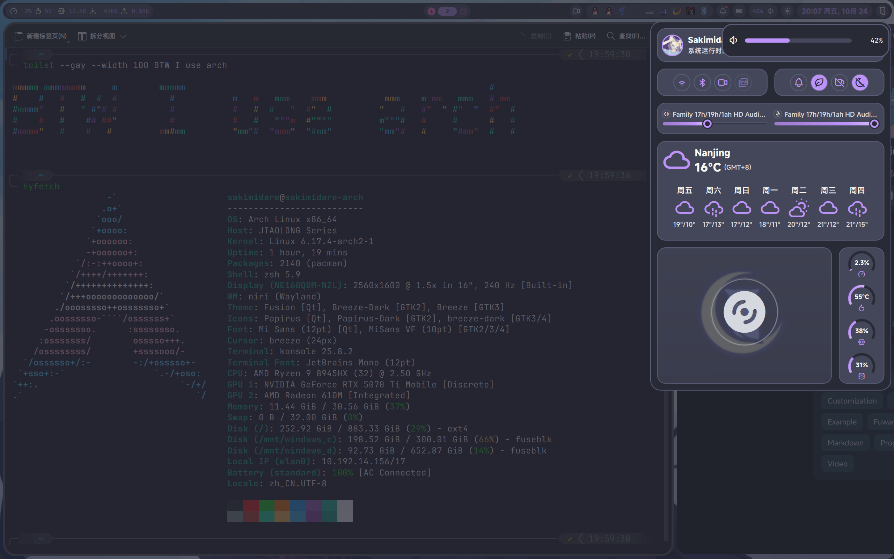

# Niri 简介

:::hyperlink{href="https://wiki.archlinux.org/title/Niri" title="Niri" avatar="https://wiki.archlinuxcn.org/favicon.ico" description="Arch Linux 的 Niri 介绍"}
:::

Niri 和 我们熟悉的 Windows 桌面或 KDE Plasma 不同。他是一个水平式排列的窗口管理器。每当新打开一个窗口，便会显示在当前窗口的右侧（而非像 Windows 那样堆叠）。在 Niri 中，没有开始按钮、没有最小化、没有最大化，有的只是随心所欲用快捷键和触摸板切换窗口的流畅操作和炫酷动画！

# 成品图

话不多说，赶快端上成品图：





通知栏的图标暂时没有配置，不过问题不大。想拥有这个炫酷 WM (Window Manager) 吗？跟我一步一步配置，你也可以做到！

# 安装步骤

:::note
下面的安装步骤假定你已经安装好了 Arch Linux。如果并非如此，请参阅其他安装 Arch Linux 的教程。我推荐阅读 [Archwiki](https://wiki.archlinuxcn.org/wiki/%E5%AE%89%E8%A3%85%E6%8C%87%E5%8D%97)。
:::

:::warning
以下教程对你有以下要求：
1. 耐心，愿意试错；
2. 阅读过[提问的智慧](https://www.sakimidare.top/posts/how-to-ask-questions-the-smart-way/)；
3. 有初步的 Linux 知识；
:::


开始之前，放几个链接：

:::hyperlink{href="https://yalter.github.io/niri/Getting-Started.html" title="Niri" avatar="https://yalter.github.io/favicon.ico" description="Niri 项目维护者的教程"}
:::

:::github{repo="YaLTeR/niri"}
:::

## 安装 Niri 软件包


:::warning

Niri 并不像 KDE Plasma 和 Xfce 一样附带了一系列 GUI 程序可以开箱即用。因此，你可能需要安装附加程序如 `blueman` 来管理蓝牙设备、`dolphin` 来浏览程序、`konsole` 来运行终端、`gwenview` 来看图、 `vlc` 打开媒体、`fcitx5` 作为中文输入法、`noto-fonts`来显示中文字体等等。为了方便起见，我**强烈建议**先安装一个桌面环境如 Xfce 或 Plasma 来获得必要的软件来省事 ~~（实际上我是从 KDE 迁移过来的，软件包依赖这块我没搞清楚，哎呀都装上就没事啦）~~ 。具体安装步骤不再赘述，请参阅[Arch Linux 中文维基](https://wiki.archlinuxcn.org/)获得必要信息。

另外，如上文所述，本文假定你是一个 Linux 用户。所以你的电脑上理应有 `git` `yay` `gcc` `clang` `rust`  `make` `python`等最基本的软件包。Niri 使用 Rust 编写，所以你得安装 `rust` 软件包来执行 `make` 操作。如有这些软件包缺失，请自行安装。
:::

你可以用这两条命令：

```sh
sudo pacman -S niri xdg-desktop-portal-gtk xdg-desktop-portal-gnome konsole swaybg swayidle hyprlock xwayland-satellite dolphin sddm brightnessctl wireplumber grim flameshot breeze wshowkeys-git fcitx5 fcitx5-qt fcitx5-chinese-addons blueman noto-fonts libnotify pipewire pipewire-pulse
yay -S noctalia-shell vicinae ttf-jetbrains-mono misans 

```
安装必要的软件包。

Noctalia Shell 是一个使用 Material Design 的用户界面。它可以接管系统通知，声音和显示亮度调节，并在最上方显示一个很他吗炫酷的状态栏。

Vicinae 是一个 App 启动器，可以把它理解为 Windows 上的开始菜单。在我的配置中，所有不在快捷键配置里的程序都需要从这里启动。

## 配置

## SDDM
Niri 安装完成后，会自动创建 `.desktop` 文件。这个 `.desktop` 文件会被 SDDM 识别并提供登录到会话的选项。如果你还没有使用 SDDM 作为登录管理器，请先启用服务。

```sh
sudo systemctl enable sddm.service
```

这样在系统开机时会自动运行 SDDM，以便启动 Niri 会话。

## 编辑 niri.service 的 wants

```sh
systemctl --user add-wants niri swayidle
```

这样做可以让 `swayidle` 软件包接管锁屏、睡眠等系统操作。
:::note
不需要照着官方文档加上 `waybar` 和 `mako`！我的配置没装这两个软件包，Shell 和通知全由 Noctalia Shell 接管！
:::

编辑 `~/.config/systemd/user/niri.service.wants/swayidle.service`。
填入以下配置：

```ini
[Unit]
PartOf=graphical-session.target
After=graphical-session.target
Requisite=graphical-session.target

[Service]
ExecStart=/usr/bin/swayidle -w timeout 601 'niri msg action power-off-monitors' timeout 600 'hyprlock' before-sleep 'hyprlock'
Restart=on-failure
```

这个配置是为了无操作 600 秒后用 `hyprlock` 锁屏，601 秒后关闭显示器。
如果有睡眠、休眠等需求，请查阅 Swaylock 官方文档。

## 修改 Niri 配置文件

创建 `~/.config/niri/config.kdl` 文件并写入配置。
除了显示器配置，其他你可以抄我的。显示器配置请根据注释自行修改。

``` typescript
// 键盘鼠标触摸板等输入设备相关配置
input {
    keyboard {
        xkb {
            layout "us"
        }

        // 在启动上启用numlock，省略此设置会禁用它。
        numlock
    }

    touchpad {
        tap
        natural-scroll
        scroll-method "two-finger"
    }

    mouse {
        // 设置鼠标移动速度,-1到1之间由慢到快
        accel-speed 1
    }

    // niri默认接管电源按钮的功能是sleep,这里禁用以使用关机功能
    disable-power-key-handling
    // 切换mod键：正常使用 Super，嵌套窗口内使用 Alt。
    mod-key "Super"
    mod-key-nested "Alt"
}

// 可以在niri实例中运行`niri msg outputs`找到显示器名称。
output "HDMI" {
    // 注释以启用此显示器。
    off

    // 默认聚焦在这个显示器
    focus-at-startup

    // 格式为"<width>x<height>" 或者 "<width>x<height>@<refresh rate>".
    // 如果省略了刷新率，niri将为分辨率选择最高的刷新率。
    mode "3840x2160@60.000"

    // 您可以使用整数或分数量表，例如，比例为150％。
    scale 2

    // transform允许逆时针旋转显示，有效值为:
    // normal, 90, 180, 270, flipped, flipped-90, flipped-180 and flipped-270.
    transform "normal"

    // 输出在所有显示器坐标空间中的位置。未明确配置位置的显示器将放置在所有已放置的显示器右侧。
    // position x=1280 y=0
}

// 如果 eDP-2 没有连接，将会默认聚焦在这个显示器
output "eDP-2" {
    // off
    focus-at-startup
    mode "2560x1600@300.000"
    transform "normal"
    position x=0 y=0
}

// 可以使用wev来查询特定的按键对应的XKB名称
binds {
    // Mod-Shift-/显示重要的热键列表(通常与 Mod-? 相同)。
    Mod+Shift+Slash { show-hotkey-overlay; }
    Mod+D hotkey-overlay-title="Open the File Manager" { spawn "/usr/bin/dolphin"; } 
    // Mod+L hotkey-overlay-title="Lock the Screen: swaylock" { spawn "/usr/bin/swaylock" "-f" "-i" "$HOME/.dotfiles/sway/.config/sway/lock.png"; }
    Mod+L hotkey-overlay-title="Lock the Screen: hyprlock" { spawn "/usr/bin/hyprlock"; }
    Mod+Return hotkey-overlay-title="Open a Terminal" { spawn "/usr/bin/konsole"; }
   // Mod+A hotkey-overlay-title="Run an Application" { spawn "/usr/bin/fuzzel"; }
    Mod+A hotkey-overlay-title="Run an Application" { spawn "/usr/bin/vicinae" "toggle"; }
    Mod+X hotkey-overlay-title="Open a browser: zen" { spawn "/usr/bin/google-chrome-stable"; }
    // Mod+D hotkey-overlay-title="同步切换obs和mpv状态" { spawn "/usr/bin/touch" "/tmp/obs_mpv_toggle_pause"; }
    Mod+K hotkey-overlay-title="打开screenkey" { spawn "/usr/bin/wshowkeys" "-a" "right" "-a" "bottom" "-F" "ComicShannsMono Nerd Font 30"; }
    Mod+Shift+K hotkey-overlay-title="关闭screenkey" { spawn "/usr/bin/killall" "wshowkeys"; }
    // Mod+Shift+C hotkey-overlay-title="重启waybar" { spawn-sh "pkill waybar && waybar"; }

    // 音量控制 allow-when-locked=true 在锁屏时的按键也会生效。这里的wpctl是wireplumber包中附带的
    XF86AudioRaiseVolume allow-when-locked=true { spawn-sh "wpctl set-volume @DEFAULT_AUDIO_SINK@ 0.1+"; }
    XF86AudioLowerVolume allow-when-locked=true { spawn-sh "wpctl set-volume @DEFAULT_AUDIO_SINK@ 0.1-"; }
    XF86AudioMute        allow-when-locked=true { spawn-sh "wpctl set-mute @DEFAULT_AUDIO_SINK@ toggle"; }
    XF86AudioMicMute     allow-when-locked=true { spawn-sh "wpctl set-mute @DEFAULT_AUDIO_SOURCE@ toggle"; }

    // 亮度控制。brightnessctl 有独立的包
    XF86MonBrightnessUp allow-when-locked=true { spawn "brightnessctl" "--class=backlight" "set" "+10%"; }
    XF86MonBrightnessDown allow-when-locked=true { spawn "brightnessctl" "--class=backlight" "set" "10%-"; }

    // 开关overview
    Mod+Tab repeat=false { toggle-overview; }
    // 关闭窗口
    Mod+Q repeat=false { close-window; }

    // 窗口焦点切换，位置移动
    Mod+Left  { focus-column-left; }
    Mod+Down  { focus-window-down; }
    Mod+Up    { focus-window-up; }
    Mod+Right { focus-column-right; }
    Mod+N     { focus-column-left; }
    Mod+i     { focus-column-right; }
    // Mod+N     { spawn-sh "niri msg action focus-column-left && niri msg action center-column"; }
    // Mod+i     { spawn-sh "niri msg action focus-column-right && niri msg action center-column"; }
    Mod+Shift+Left  { move-column-left; }
    Mod+Shift+Down  { move-window-down; }
    Mod+Shift+Up    { move-window-up; }
    Mod+Shift+Right { move-column-right; }
    Mod+Shift+N     { move-column-left; }
    Mod+Shift+I     { move-column-right; }

    Mod+Home { focus-column-first; }
    Mod+End  { focus-column-last; }
    Mod+Shift+Home { move-column-to-first; }
    Mod+Shift+End  { move-column-to-last; }

    // workspace焦点切换，窗口在workspace之间移动
    Mod+Page_Down      { focus-workspace-down; }
    Mod+Page_Up        { focus-workspace-up; }
    Mod+Ctrl+Page_Down { move-column-to-workspace-down; }
    Mod+Ctrl+Page_Up   { move-column-to-workspace-up; }
    // 上下移动整个workspace
    Mod+Shift+Page_Down { move-workspace-down; }
    Mod+Shift+Page_Up   { move-workspace-up; }

    // 上下方向共用的窗口、工作空间的焦点切换和位置移动
    Mod+E     { focus-window-or-workspace-down; }
    Mod+U     { focus-window-or-workspace-up; }
    Mod+Shift+E     { move-window-down-or-to-workspace-down; }
    Mod+Shift+U     { move-window-up-or-to-workspace-up; }

    // 显示器焦点切换
    Mod+Ctrl+Left  { focus-monitor-left; }
    Mod+Ctrl+Down  { focus-monitor-down; }
    Mod+Ctrl+Up    { focus-monitor-up; }
    Mod+Ctrl+Right { focus-monitor-right; }
    Mod+Ctrl+N     { focus-monitor-left; }
    Mod+Ctrl+E     { focus-monitor-down; }
    Mod+Ctrl+U     { focus-monitor-up; }
    Mod+Ctrl+I     { focus-monitor-right; }

    // 跨显示器移动窗口
    Mod+Shift+Ctrl+Left  { move-column-to-monitor-left; }
    Mod+Shift+Ctrl+Down  { move-column-to-monitor-down; }
    Mod+Shift+Ctrl+Up    { move-column-to-monitor-up; }
    Mod+Shift+Ctrl+Right { move-column-to-monitor-right; }
    Mod+Shift+Ctrl+N     { move-column-to-monitor-left; }
    Mod+Shift+Ctrl+E     { move-column-to-monitor-down; }
    Mod+Shift+Ctrl+U     { move-column-to-monitor-up; }
    Mod+Shift+Ctrl+I     { move-column-to-monitor-right; }

    // 鼠标相关快捷键
    Mod+WheelScrollDown      cooldown-ms=150 { focus-workspace-down; }
    Mod+WheelScrollUp        cooldown-ms=150 { focus-workspace-up; }
    Mod+Ctrl+WheelScrollDown cooldown-ms=150 { move-column-to-workspace-down; }
    Mod+Ctrl+WheelScrollUp   cooldown-ms=150 { move-column-to-workspace-up; }

    Mod+WheelScrollRight      { focus-column-right; }
    Mod+WheelScrollLeft       { focus-column-left; }
    Mod+Ctrl+WheelScrollRight { move-column-right; }
    Mod+Ctrl+WheelScrollLeft  { move-column-left; }

    Mod+Shift+WheelScrollDown      { focus-column-right; }
    Mod+Shift+WheelScrollUp        { focus-column-left; }
    Mod+Ctrl+Shift+WheelScrollDown { move-column-right; }
    Mod+Ctrl+Shift+WheelScrollUp   { move-column-left; }

    Mod+TouchpadScrollDown { spawn-sh "wpctl set-volume @DEFAULT_AUDIO_SINK@ 0.02+"; }
    Mod+TouchpadScrollUp   { spawn-sh "wpctl set-volume @DEFAULT_AUDIO_SINK@ 0.02-"; }

    Mod+1 { focus-workspace 1; }
    Mod+2 { focus-workspace 2; }
    Mod+3 { focus-workspace 3; }
    Mod+4 { focus-workspace 4; }
    Mod+5 { focus-workspace 5; }
    Mod+6 { focus-workspace 6; }
    Mod+7 { focus-workspace 7; }
    Mod+8 { focus-workspace 8; }
    Mod+9 { focus-workspace 9; }
    Mod+0 { focus-workspace 10; }
    Mod+Shift+1 { move-column-to-workspace 1; }
    Mod+Shift+2 { move-column-to-workspace 2; }
    Mod+Shift+3 { move-column-to-workspace 3; }
    Mod+Shift+4 { move-column-to-workspace 4; }
    Mod+Shift+5 { move-column-to-workspace 5; }
    Mod+Shift+6 { move-column-to-workspace 6; }
    Mod+Shift+7 { move-column-to-workspace 7; }
    Mod+Shift+8 { move-column-to-workspace 8; }
    Mod+Shift+9 { move-column-to-workspace 9; }
    Mod+Shift+0 { move-column-to-workspace 10; }

    // 最大化和全屏
    Mod+W { toggle-windowed-fullscreen; }
    Mod+F { expand-column-to-available-width; }
    Mod+Shift+F { fullscreen-window; }

    // 未最大化的窗口居中
    Mod+C { center-column; }
    Mod+Ctrl+C { center-visible-columns; }

    // 在layout中预设的宽度之间切换
    Mod+R { switch-preset-column-width; }

    // 改变宽度单位可以有pixels、百分比
    Mod+Minus { set-column-width "-10%"; }
    Mod+Equal { set-column-width "+10%"; }

    // 改变高度
    Mod+Shift+Minus { set-window-height "-10%"; }
    Mod+Shift+Equal { set-window-height "+10%"; }

    // 切换悬浮窗，改变平铺和悬浮窗焦点
    Mod+Shift+Space       { toggle-window-floating; }
    Mod+Space { switch-focus-between-floating-and-tiling; }

    // 截图
    Alt+J { spawn-sh "grim -g \"$(slurp)\" - | satty --filename - --output-filename ~/$(date '+%Y%m%d-%H:%M:%S').png"; }
    Alt+Shift+J { spawn "flameshot" "gui"; }
    Print { screenshot show-pointer=false; }
    Ctrl+Print { screenshot-screen write-to-disk=true; }
    Alt+Print { screenshot-window write-to-disk=true; }

    // 针对虚拟机软件可能需要键盘控制权。allow-inhibiting=false 忽略当前快捷键本身
    Mod+Escape allow-inhibiting=false { toggle-keyboard-shortcuts-inhibit; }

    // 退出niri将显示一个确认对话框，以避免意外退出。
    Mod+Shift+Q { quit; }

    // 关闭显示器。移动鼠标或按下任意按键恢复
    Mod+Shift+P { power-off-monitors; }
}

// 影响窗口的位置和尺寸的设置。
layout {
    // 在逻辑像素中设置Windows周围的缝隙。
    gaps 10

    // 存在多个窗口时，未最大化的窗口不自动居中，方便分屏
    center-focused-column "never"
    // 只有一个窗口时自动居中显示
    always-center-single-column

    // mod+r在预设之间切换的宽度。
    preset-column-widths {
        proportion 0.5
        proportion 0.2444
        proportion 0.7556
        // 固定设置逻辑像素的宽度精确设置。（受scale影响）
        // fixed 1920
    }

    // 关闭聚焦框
    focus-ring {
        // off
    }

    // 关闭边框
    border {
        off
    }
}

// 覆盖由niri启动的进程的环境变量
environment {
    QT_QPA_PLATFORMTHEME "qt5ct"
    // ALL_PROXY "http://127.0.0.1:7890"
    LANG "zh_CN.UTF-8"
    LC_CTYPE "zh_CN.UTF-8"
    LC_NUMERIC "zh_CN.UTF-8"
    LC_TIME "zh_CN.UTF-8"
    LC_COLLATE "zh_CN.UTF-8"
    LC_MONETARY "zh_CN.UTF-8"
    LC_MESSAGES "zh_CN.UTF-8"
    LC_PAPER "zh_CN.UTF-8"
    LC_NAME "zh_CN.UTF-8"
    LC_ADDRESS "zh_CN.UTF-8"
    LC_TELEPHONE "zh_CN.UTF-8"
    LC_MEASUREMENT "zh_CN.UTF-8"
    LC_IDENTIFICATION "zh_CN.UTF-8"
    LC_ALL null
    QT_IM_MODULE "fcitx"
    // https://fcitx-im.org/wiki/Using_Fcitx_5_on_Wayland#Sway
    XMODIFIERS "@im=fcitx"
    QT_IM_MODULES "wayland;fcitx"
    GTK_IM_MODULE null // wayland 不需要这个东西
    SDL_IM_MODULE null
    GLFW_IM_MODULE null
}
spawn-at-startup "/usr/bin/hyprlock"
// 启动niri时自动启动的软件
spawn-at-startup "/usr/bin/fcitx5"
// spawn-at-startup "/usr/bin/v2rayn"
// spawn-at-startup "/usr/bin/waybar"
spawn-at-startup "/usr/bin/vicinae" "server"
spawn-at-startup "~/.cargo/bin/soteria"
spawn-at-startup "~/Desktop/tools/update_repositories.sh"
spawn-at-startup "qs" "-c" "noctalia-shell"

// 要运行shell命令（带有变量，管道等），请使用spawn-sh-at-at-startup：
spawn-sh-at-startup "swaybg -i /path/to/your/wallpaper.png -m fill"

hotkey-overlay {
    // 跳过“重要的热键”弹出窗口。
    skip-at-startup
}

// 设置截图保存的路径，null将会禁止保存到磁盘
screenshot-path "~/%Y-%m-%d %H-%M-%S.png"

// 忽略软件自带的装饰(例如标题栏)
prefer-no-csd

// 指定光标的主题和大小，打字时隐藏光标
cursor {
    xcursor-theme "breeze" // 得安装 Breeze 主题
    xcursor-size 24
    hide-when-typing
}

// 使用`niri msg windows`查看Title和App ID等信息
window-rule {
    open-on-output "eDP-2"
    // default-window-height { proportion 0.9; }
    // default-floating-position x=100 y=200 relative-to="bottom-left"
    // default-column-width { proportion 0.7556; }
    geometry-corner-radius 20 
    clip-to-geometry true
    focus-ring {
        // off
        on
        width 4
        active-color "#bd93f9"
        inactive-color "#505050"
        urgent-color "#9b0000"
        // active-gradient from="#80c8ff" to="#bbddff" angle=45
        // inactive-gradient from="#505050" to="#808080" angle=45 relative-to="workspace-view"
        // urgent-gradient from="#800" to="#a33" angle=45
    }
    // opacity 0.75
}
window-rule {
    open-on-output "eDP-2"
    match app-id="scrcpy"
    default-column-width { proportion 0.2444; }
}
window-rule {
    open-on-output "eDP-2"
    match app-id=r#"firefox"#
    default-column-width { proportion 0.2444; }
    border {
        on
        width 2
        active-color "#61AFEF"
    }
    // open-focused false
}
window-rule {
    match app-id="com.gabm.satty" title="satty"
    border {
        on
        width 2
        active-color "#61AFEF"
    }
}

// `niri msg layers`显示有namespace可以在这里配置waybar透明度
layer-rule {
    match namespace="^quickshell-overview$"
    place-within-backdrop true
    //     opacity 0.75
}
debug {
    honor-xdg-activation-with-invalid-serial
}
// 禁用鼠标左上角热角
gestures {
    hot-corners {
        off
    }
}

```

这里面热键配置部分的 `Mod` 在 SDDM 启动的 Niri 下全部代指 Super 键（也就是印刷着 Windows 徽标的那个键）。

以下是几个常用热键：

|  热键  |  功能  |
|-------|--------|
|Mod + Shift + /(?) | 显示热键菜单 |
|Mod + A | 打开 Vicinae (App 启动器) |
|Mod + D | 打开 Dolphin（文件管理器） |
|Mod + X | 打开 `google-chrome-stable` （浏览器，需安装）|
|Mod + Enter | 打开 Konsole （终端）|
|Mod + F | 将当前窗口全屏 |
|Mod + L | 用 Hyprlock 锁屏 |
|Mod + 左右箭头 | 切换窗口左右焦点 |
|Mod + Shift + 左右箭头| 将当前列和左右列互换位置 |
|Mod + PgUp / PgDn| 上下切换工作区 |
|Mod + Ctrl + PgUp / PgDn | 将当前列移动到上下工作区 |
|Mod + Tab| 进入 Overview （缩小整个屏幕以显示工作区概览） |
|PrtSc| 截屏并复制到剪贴板以及保存到 ~ |
|Ctrl + PrtSc | 截全屏，操作同上 |
|三指滑动触摸板| 切换窗口以及工作区 |
|四指滑动触摸板| 操作同 Mod + Tab|

还有不少热键，懒得打了，看上面的配置吧。个人用得比较多的就这几个了。

注意：

```ts
// 要运行shell命令（带有变量，管道等），请使用spawn-sh-at-at-startup：
spawn-sh-at-startup "swaybg -i /path/to/your/wallpaper.png -m fill"
```

这一行请务必填入自己的壁纸位置，否则壁纸是灰的！

:::note
本配置使用 `swaybg` 接管壁纸，所以无需在 Noctalia Shell 里面设置壁纸。
:::

## 修改 Hyprlock 配置文件

~~（我喜欢混搭）~~

```
~/.config/hypr
├── hyprlock.conf
└── mocha
    └── mocha.conf
```

请创建如上所示的目录结构，即运行
``` sh
mkdir ~/.config/hypr
mkdir ~/.config/hypr/mocha
touch ~/.config/hypr/hyprlock.conf
touch ~/.config/hypr/mocha/mocha.conf
```

请编辑 `~/.config/hypr/hyprlock.conf`，填入以下配置：

```ini
source = $HOME/.config/hypr/mocha/mocha.conf

$accent = $mauve
$accentAlpha = $mauveAlpha
$font = JetBrains Mono

# GENERAL
general {
  hide_cursor = true
}

# BACKGROUND
background {
  monitor =
  path = /path/to/your/wallpaper.png
  blur_passes = 0
  color = $base
}

# LAYOUT
label {
  monitor =
  text = Layout: $LAYOUT
  color = $text
  font_size = 25
  font_family = $font
  position = 30, -30
  halign = left
  valign = top
}

# TIME
label {
  monitor =
  text = $TIME
  color = $text
  font_size = 90
  font_family = $font
  position = -30, 0
  halign = right
  valign = top
}

# DATE
label {
  monitor =
  text = cmd[update:43200000] date +"%Y年 %m月 %d日, %A"
  color = $text
  font_size = 25
  font_family = $font
  position = -30, -150
  halign = right
  valign = top
}

# FINGERPRINT
{
  monitor = "";
  text = "$FPRINTPROMPT";
  color = "$text";
  font_size = 14;
  font_family = $font;
  position = "0, -107";
  halign = "center";
  valign = "center";
}

# USER AVATAR
image {
  monitor =
  path = $HOME/.face
  size = 100
  border_color = $accent
  position = 0, 75
  halign = center
  valign = center
}

# INPUT FIELD
input-field {
  monitor =
  size = 300, 60
  outline_thickness = 4
  dots_size = 0.2
  dots_spacing = 0.2
  dots_center = true
  outer_color = $accent
  inner_color = $surface0
  font_color = $text
  fade_on_empty = false
  placeholder_text = <span foreground="##$textAlpha"><i>󰌾 Logged in as </i><span foreground="##$accentAlpha">$USER</span></span>
  hide_input = false
  check_color = $accent
  fail_color = $red
  fail_text = <i>$FAIL <b>($ATTEMPTS)</b></i>
  capslock_color = $yellow
  position = 0, -47
  halign = center
  valign = center
}

```

请在

```ini
# BACKGROUND
background {
  monitor =
  path = /path/to/your/wallpaper.png
  blur_passes = 0
  color = $base
}
```
填入锁屏壁纸的位置。

编辑 `~/.config/hypr/mocha/mocha.conf`，填入以下配置：

```ini
$rosewater = rgb(f5e0dc)
$rosewaterAlpha = f5e0dc

$flamingo = rgb(f2cdcd)
$flamingoAlpha = f2cdcd

$pink = rgb(f5c2e7)
$pinkAlpha = f5c2e7

$mauve = rgb(cba6f7)
$mauveAlpha = cba6f7

$red = rgb(f38ba8)
$redAlpha = f38ba8

$maroon = rgb(eba0ac)
$maroonAlpha = eba0ac

$peach = rgb(fab387)
$peachAlpha = fab387

$yellow = rgb(f9e2af)
$yellowAlpha = f9e2af

$green = rgb(a6e3a1)
$greenAlpha = a6e3a1

$teal = rgb(94e2d5)
$tealAlpha = 94e2d5

$sky = rgb(89dceb)
$skyAlpha = 89dceb

$sapphire = rgb(74c7ec)
$sapphireAlpha = 74c7ec

$blue = rgb(89b4fa)
$blueAlpha = 89b4fa

$lavender = rgb(b4befe)
$lavenderAlpha = b4befe

$text = rgb(cdd6f4)
#$text = rgb(6c8cf5)
#$textAlpha = 6c8cf5
$textAlpha = cdd6f4

$subtext1 = rgb(bac2de)
$subtext1Alpha = bac2de

$subtext0 = rgb(a6adc8)
$subtext0Alpha = a6adc8

$overlay2 = rgb(9399b2)
$overlay2Alpha = 9399b2

$overlay1 = rgb(7f849c)
$overlay1Alpha = 7f849c

$overlay0 = rgb(6c7086)
$overlay0Alpha = 6c7086

$surface2 = rgb(585b70)
$surface2Alpha = 585b70

$surface1 = rgb(45475a)
$surface1Alpha = 45475a

$surface0 = rgb(313244)
$surface0Alpha = 313244

$base = rgb(1e1e2e)
$baseAlpha = 1e1e2e

$mantle = rgb(181825)
$mantleAlpha = 181825

$crust = rgb(11111b)
$crustAlpha = 11111b
```

左右上角的文字颜色定义在
```ini
$text = rgb(cdd6f4)
#$text = rgb(6c8cf5)
#$textAlpha = 6c8cf5
$textAlpha = cdd6f4
```

若觉得和壁纸不搭，可以直接替换成喜欢的 RGB 色值。

## 配置 SDDM 自动登录

上面 Niri 配置中我们写到了
```ts
spawn-at-startup "/usr/bin/hyprlock"
```

为了跳过 SDDM 之后仍保证系统安全，这里会在启动 Niri 时自动锁屏。所以我们现在来配置 SDDM 自动登录。

编辑 `/etc/sddm.conf.d/autologin.conf` ，在里面加入：
```ini
[Autologin]
User=#your_username
Session=niri
```

请将 `#your_username` 改成你的用户名。

## 重启，拥抱 Niri!

不出意外的话，重启之后，输入密码，你就能看到 Noctalia Shell 的欢迎界面了！

拥抱 Niri 吧！拥抱一个比 KDE Plasma 占用少得多且美观的 WM ！

# 疑难解答

由于我是中途从 KDE 转向了 Niri 而非全新安装，所以这篇教程很有可能有软件包依赖以及其他大大小小的问题。如果遇到了问题，欢迎在评论区提出！

## 为什么我的输入法在 QQ 里面坏掉了？

你需要创建 `~/.config/qq-flags.conf`，在里面填入

```ini
--ozone-platform=wayland
--enable-wayland-ime
--wayland-text-input-version=3
```

## 为什么右上角的应用图标这么丑？

我不到啊我也很难受！我会想办法的（跪）

## 为什么有些 GTK 软件是亮色的？这与我的主题不搭！
```sh
dconf write /org/gnome/desktop/interface/color-scheme '"prefer-dark"'
```

## ... ？
留言吧求求了！！

# 最后

```sh
sudo pacman -S fastfetch hyfetch
hyfetch
```

盯着你的电脑屏幕看几分钟，享受你的艺术品吧！